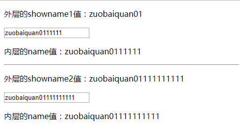

### **angualrjs中ng-if与ng-show或hide区别**

```
1. ng-if在后面表达式为 true 的时候才创建这个 dom 节点，ng-show是初始时就创建了，用 display:block和 display:none 来控制显示和不显示。

2. ng-if会（隐式地）产生新作用域，ng-switch、 ng-include 等会动态创建一块界面的也是如此。这样会导致，在 ng-if中用基本变量绑定 ng-model，并在外层 div 中把此 model 绑定给另一个显示区域，内层改变时，外层不会同步改变，因为此时已经是两个变量了。
```

```html
<body ng-app="myApp">
<div ng-controller="firstController">
    <div>========ng-if========</div>
    <p>外层的showname1值：{{showname1}}</p>
    <div ng-if="true">
        <input type="text" ng-model="showname1">
        <p>内层的name值：{{showname1}}</p>
    </div>

    <hr/>
    <div>========ng-show========</div>
    <p>外层的showname2值：{{showname2}}</p>
    <div ng-show="true">
        <input type="text" ng-model="showname2">
        <p>内层的name值：{{showname2}}</p>
    </div>
</div>
</body>
<script type="text/javascript" src="../lib/angular.js"></script>
<script type="text/javascript">
    angular.module("myApp",[]).controller("firstController", function ($scope) {
        $scope.showname1="zuobaiquan01";
        $scope.showname2="zuobaiquan01";
    });  
</script>
```

