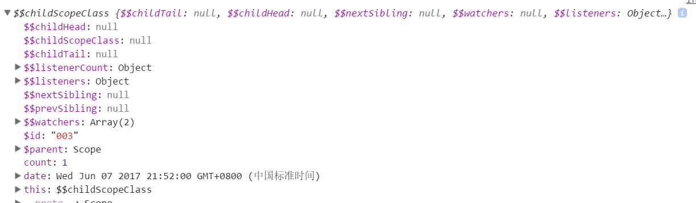
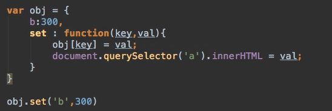
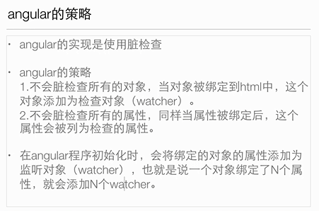
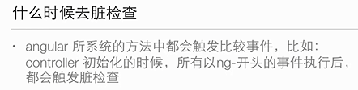
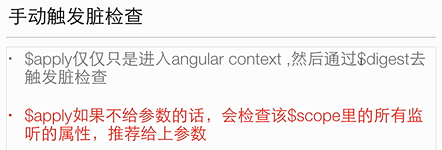
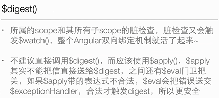

```
scope是一个指向应用model的object，也是表达式的执行上下文

scope被放置于一个类似应用的DOM结构的层次结构中
```

打印 $scope 类似js的作用域链一样，它有父亲，上一个兄弟，下一个兄弟等




$apply

```bash
$scope.$apply(expression)
$apply()方法可以在angualr框架之外执行angualrjs表达式，例如：DOM事件、setTimeout、XHR或其他第三方的库
```

angualr是怎么知道变量发生了变化

```
要知道一个变量变了，方法不外乎两种

1、能通过固定的接口才能改变的值，比如说只能通过set()设置变量的值，set被调用时比较一下就知道了。这种方法的缺点是写法繁琐；

2、脏检查，将原对象复制一份快照，在某个时间，比较现在对象与快照的值，如果不一样就表明发生变化，这个策略要保留两份变量，而且要遍历对象，比较每一个属性，这样会有一定性能问题。

```










```javascript
$scope.date=new Date();
$scope.count=0;
setInterval(function(){
	$scope.$apply(function(){
		$scope.date=new Date();
		$scope.count++;
	});
},1000);
```

